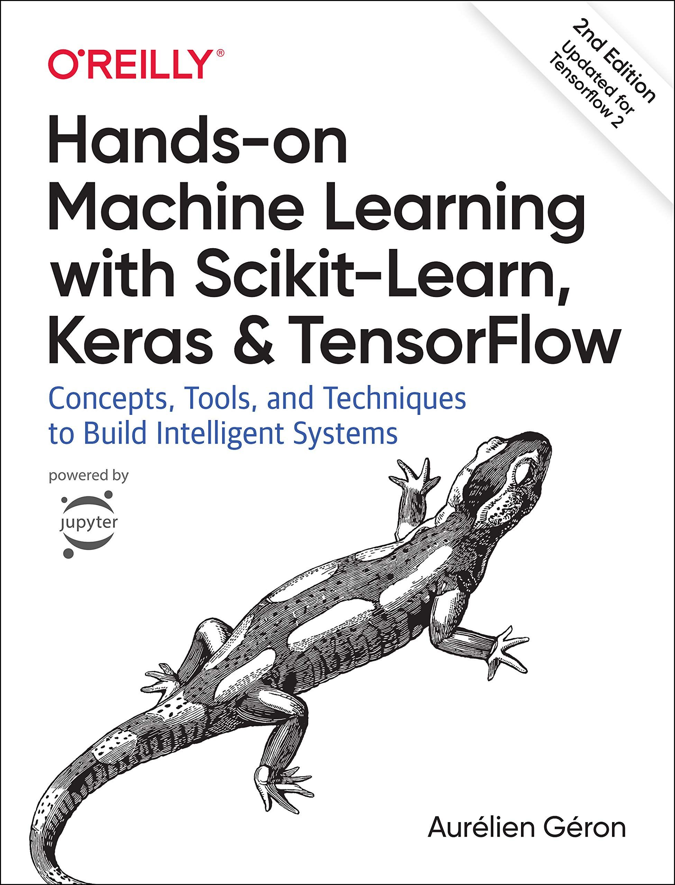

# hands_on_ml_book_study
Minhas soluções e anotações do livro Hands-on Machine Learning with Scikit-Learn, Keras and TensorFlow 2nd ed.
Os notebooks, originalmente para uso pessoal, estão em variados estados de acabamento e anotações. No entento abrangem uma boa variedade de tópicos desde regressão linear até uma breve introdução à Keras e ANNs. 

