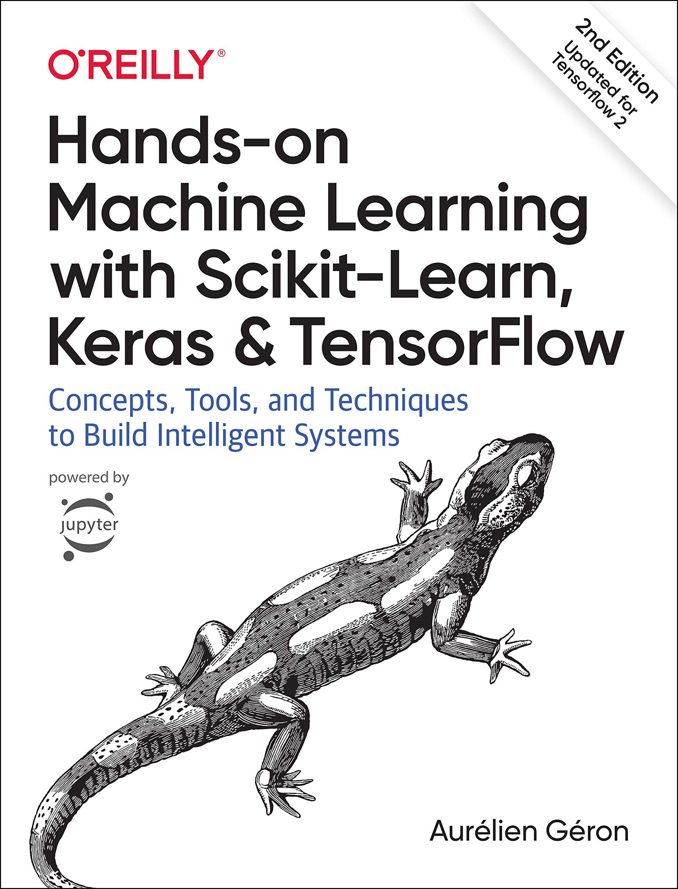

# hands_on_ml_book_study
Anotações e soluções de problemas do livro Hands-on Machine Learning with Scikit-Learn, Keras and TensorFlow 2nd ed.
Abrangem uma boa variedade de tópicos desde regressão linear até uma breve introdução à Keras e ANNs. 

